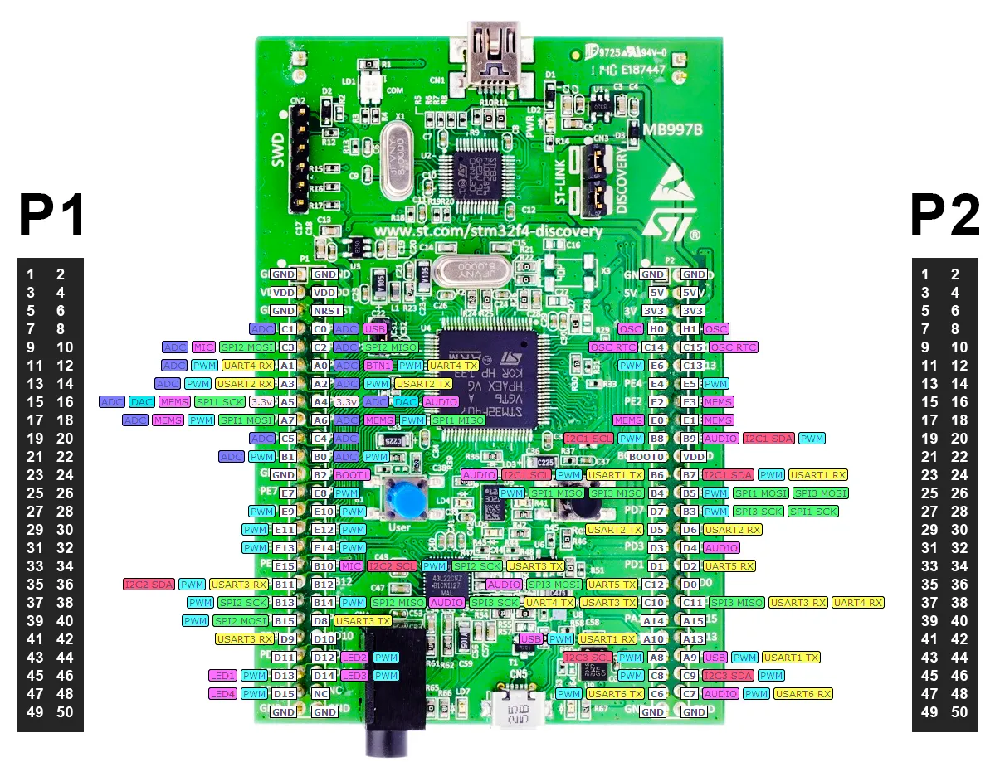

# SPŠE ARM Kit - dokumentace

Dokumentace ke školnímu ARM přípravku

## Discovery 

### F407

Školní ARM kit běží na desce discovery. Jednou ze zvláštností školního kitu v revizi 1 je 
pin `PE10 (DIR)`, který je použítý pro posílení sběrnice (připojení LCD). Novější revize
ho nepouživají.

  

Pinout zapojení

  

  

  

Manuály

- [Referenční příručka](boards/DISCOVERY/STM32F407VGT6-DISCOVERY/STM32F4xx_reference-manual.pdf)
- [Uživatelský manuál](boards/DISCOVERY/STM32F407VGT6-DISCOVERY/STM32F4xx-DISCOVERY_user-manual_2.pdf)
- [Specifikace desky](boards/DISCOVERY/STM32F407VGT6-DISCOVERY/STM32F4xx-DISCOVERY_board_2.pdf)
  

## Nucleo

### F401

### F411

### G071

### L152

## Poznámky

### Školní Keil uVision verze

[Keil výpis](Keil_version.txt)
