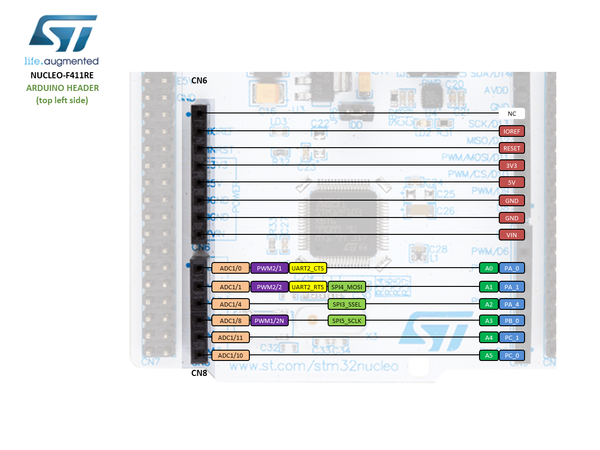

# SPŠE ARM Kit - dokumentace

Dokumentace a materiály ke školnímu ARM přípravku.

## Discovery 

### F407

Školní ARM kit běží na desce discovery. Jednou ze zvláštností školního kitu v revizi 1 je 
pin `PE10 (DIR)`, který je použítý pro posílení sběrnice (připojení LCD). Novější revize
ho nepouživají.

  

Pinout zapojení

  

  

  

Manuály

- [Referenční příručka](boards/DISCOVERY/STM32F407VGT6-DISCOVERY/STM32F4xx_reference-manual.pdf)
- [Uživatelský manuál](boards/DISCOVERY/STM32F407VGT6-DISCOVERY/STM32F4xx-DISCOVERY_user-manual_2.pdf)
- [Specifikace desky](boards/DISCOVERY/STM32F407VGT6-DISCOVERY/STM32F4xx-DISCOVERY_board_2.pdf)
  

## Nucleo

### F401

  

Pinout - Arduino

Pinout - Morho

  

Manuály

- [Referenční příručka](boards/NUCLEO/STM32F401RET6-NUCLEO/STM32F401_reference-manual.pdf)
- [Uživatelský manuál](boards/NUCLEO/STM32F401RET6-NUCLEO/STM32F401_user-manual.pdf)
- [Datasheet](boards/NUCLEO/STM32F401RET6-NUCLEO/STM32F401_datasheet-stm32f401.pdf)

### F411

  

Pinout - Arduino

Pinout - Morho

  

Manuály

- [Referenční příručka](boards/NUCLEO/STM32F411RET6-NUCLEO/STMF411_reference-manual.pdf)
- [Uživatelský manuál](boards/NUCLEO/STM32F411RET6-NUCLEO/STM32F411_user-manual.pdf)

### G071

  

Pinout - Arduino

Pinout - Morho

  

Manuály

- [Referenční příručka](boards/NUCLEO/STM32G071RBT6-NUCLEO/STM32G0x1_reference-manual.pdf)
- [Uživatelský manuál](boards/NUCLEO/STM32G071RBT6-NUCLEO/STM32G0x1_user-manual.pdf)
- [Programatorský manual](boards/NUCLEO/STM32G071RBT6-NUCLEO/STM32G0_programming-manual.pdf)

### L152

  

Pinout - Arduino

Pinout - Morho

  

Manuály

  
- [Referenční příručka](boards/NUCLEO/STM32L152RET6-NUCLEO/STM32L152_reference-manual.pdf)
- [Uživatelský manuál](boards/NUCLEO/STM32L152RET6-NUCLEO/STM32L152_user-manual.pdf)
- [Datasheet](boards/NUCLEO/STM32L152RET6-NUCLEO/STM32L152_datasheet.pdf)
  

## Poznámky

### Školní Keil uVision verze

Školní verze Keil uVision IDE je 5.18

  

Screenshot

  

[Keil výpis](etc/Keil_version.txt)
